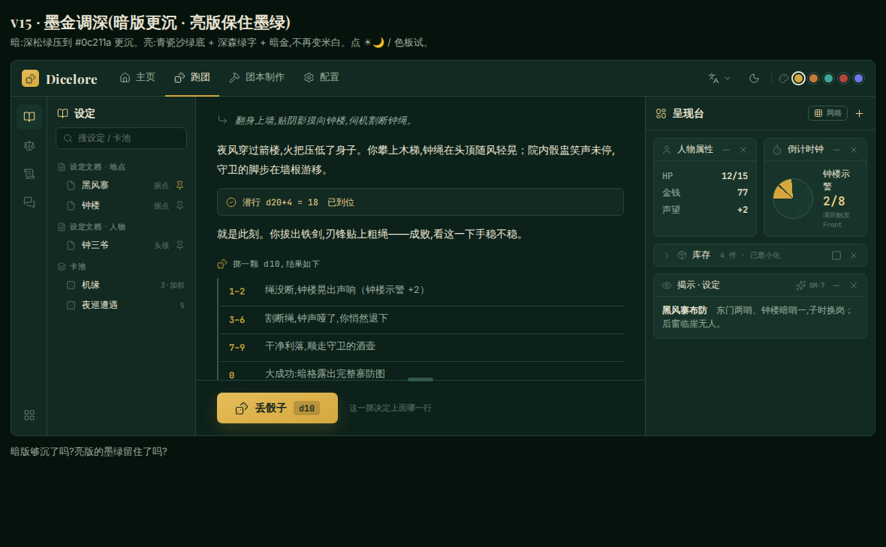
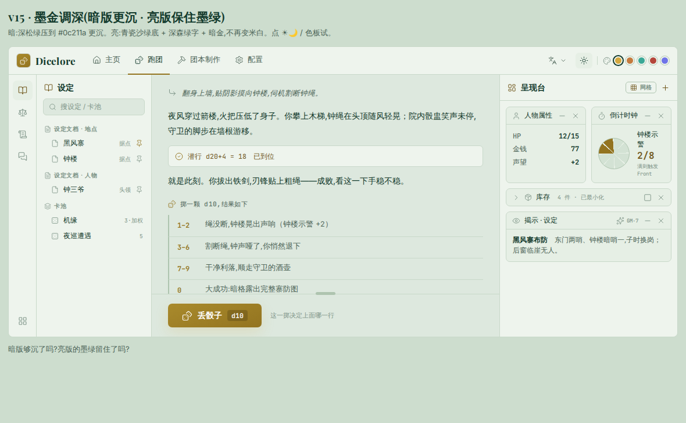
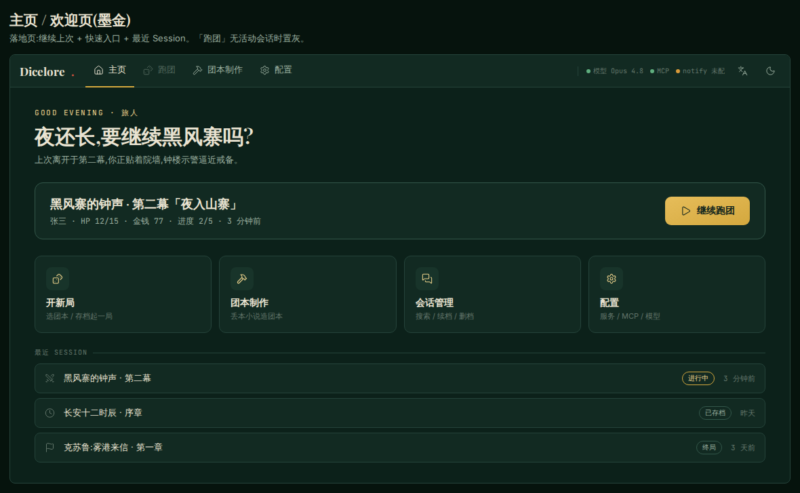
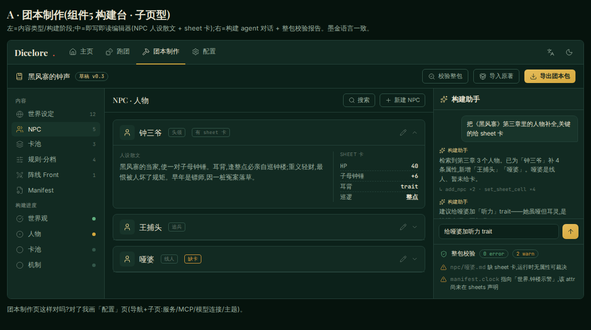
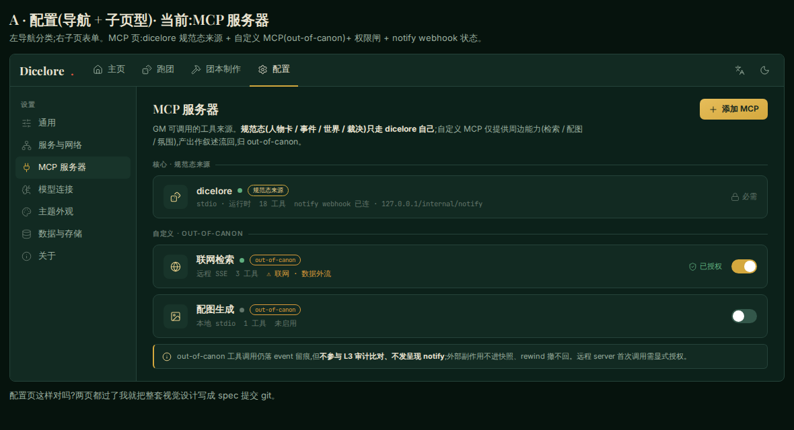

# 玩家客户端 · 视觉定稿草图

> 配套 [玩家客户端-视觉](../玩家客户端-视觉.md) 的**可运行 HTML 定稿草图**,供未来实现参考。**非交付代码、非框架选型**——只是把"墨金 · 案上"设计语言与四页 IA 固定成可在浏览器打开的静态原型。

## 四页

| 文件 | 页面 | 看点 |
|---|---|---|
| [play.html](play.html) | **跑团**（定稿 v15） | VSCode 式 bar + 左活动轨(设定/规则/日志/会话) + 中央叙事打字一体(可拖拽分隔条) + 右**呈现台**(网格停靠/可最小化/style 预设) · d10 区间 + 烫金丢骰子 · 圆形 PbtA 倒计时钟 |
| [home.html](home.html) | **主页** | 继续上次 + 快速入口 + 最近 Session;bar 右运行态指示 |
| [build.html](build.html) | **团本制作** | 组件5 构建台入壳:内容类型/构建进度导航 + 即写即读编辑器(NPC 散文+sheet 卡) + 构建助手对话 + 整包校验报告 |
| [config.html](config.html) | **配置** | 导航 + 子页;MCP 服务器(dicelore 规范态来源 + 自定义 out-of-canon + 权限闸 + notify) |

### 跑团（play）

明暗双态(同一套 token,点右上 ☀🌙 切换):

### 主页（home）

### 团本制作（build）

### 配置（config）

## 设计语言（详见 [玩家客户端-视觉](../玩家客户端-视觉.md)）

- **墨金主题**：深墨绿底 `#0c211a` + 赤金 `#d4a83e`;明暗双态(点右上 ☀🌙)、强调色可选(色板)均为主题 token。
- **字体**：Playfair Display(标题) + Inter(界面) + JetBrains Mono(数据)。
- **图标**：Lucide 线性 SVG(禁 emoji)。

## 怎么看

直接用浏览器打开任一 `.html`。**需联网**——字体(Google Fonts)与图标(Lucide CDN unpkg)走 CDN;离线则字体 fallback、图标不显。`play.html` / `home.html` 的明暗/色板按钮可点切换。

> 这些是 brainstorming 视觉伴侣的定稿快照(2026-06-21),后续实现以 `packages/shared` 契约 + `frontend/` 为准,样式从这些草图取色取形。

## 品牌 / Logo

终版字标 **Dicelore.**(`Dice` 金 / `lore` 纸白 / 句点朱砂红)+ **宝石切面 d20**(亮金分面 + 内部黑棱錾刻 + 外圈金边,"20" 用 Pirata One 哥特体)。可交互预览见 [logo.html](logo.html)。

| 文件 | 内容 |
|---|---|
| [dicelore-d20.svg](dicelore-d20.svg) | d20 单标 · 矢量(可任意缩放;"20" 依赖 Pirata One,缺字回退衬线) |
| dicelore-logo.png / -dark.png | 主标(d20 + 字标)· 透明底 / 墨绿底 · 1732×592 |
| dicelore-mark.png / -dark.png | d20 单标 · 透明 / 墨绿 · 1184² |
| dicelore-wordmark.png / -dark.png | 纯字标 · 透明 / 墨绿 · 1292×480 |

> 字体来源(均 Google Fonts/开源):Playfair Display(字标)· Pirata One(d20 数字)。
